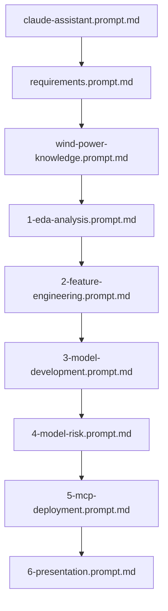

# The Temus Workspace: A Domain-Specific Code Generation Framework

This workspace represents a sophisticated prompt engineering architecture that goes beyond typical AI assistance patterns. It's essentially a **domain-specific code generation framework** designed to produce quality wind power forecasting solutions with minimal human intervention.

## Framework Architecture

### 1. Layered Knowledge System

The framework operates on three distinct knowledge layers:

```
┌─────────────────────────────────────────┐
│         Application Layer               │
│  (Phase-specific implementation prompts)│
├─────────────────────────────────────────┤
│         Domain Layer                    │
│  (Wind power physics, business context) │
├─────────────────────────────────────────┤
│         Foundation Layer                │
│  (Coding standards, patterns, style)    │
└─────────────────────────────────────────┘
```

**Foundation Layer** (`claude-assistant.prompt.md`, `requirements.prompt.md`):
- Establishes communication protocols
- Defines code quality standards
- Sets business communication style
- Enforces McKinsey presentation standards

**Domain Layer** (`wind-power-knowledge.prompt.md`):
- Encodes wind power physics (power curves, cut-in/cut-out speeds)
- Captures industry-specific challenges (curtailment, grid balancing)
- Provides economic context ($1-5M savings per 10% RMSE improvement)
- Documents dataset-specific quirks (GEF2012 structure)

**Application Layer** (phase-specific prompts):
- Implements complete solutions for each project phase
- Contains production-ready code patterns
- Includes error handling, monitoring, deployment specifics

### 2. Template-Based Code Generation

Each phase prompt acts as a sophisticated code template with:

```python
# Example from eda-analysis.prompt.md
def create_power_curve_analysis():
    """
    Template includes:
    - Complete implementation
    - Decorator pattern for visualizations
    - Error handling
    - styling
    - Physical constraints validation
    """
```

This isn't just guidance - it's executable code with placeholders for data-specific parameters.

### 3. Cross-Prompt Dependency Management

The framework implements a dependency graph between prompts:



Each prompt builds on previous ones, maintaining consistency and avoiding duplication.

## Framework Features

### 1. Production-Ready Code Generation

Unlike typical prompts that provide guidance, this framework generates:
- Complete, runnable implementations
- Professional-grade error handling
- Monitoring and logging infrastructure
- Deployment-ready configurations

Example from deployment prompt:
```python
@app.route('/forecast/<farm_id>', methods=['POST'])
@validate_request
@monitor_performance
@cache_results(ttl=300)
def forecast_endpoint(farm_id):
    # Complete implementation with all production concerns
```

### 2. Domain-Specific Optimizations

The framework pre-optimizes for wind power forecasting:
- Cubic transformations for wind speed
- Directional component decomposition
- Temporal pattern extraction
- Physical constraint validation

### 3. Business Context Integration

Every technical decision is pre-qualified against business requirements:
- ROI calculations embedded in model selection
- Risk metrics aligned with grid operations
- Deployment strategies considering operational constraints

## Framework Workflow

### 1. Initialization Phase
```bash
# User provides minimal input
"I need to analyze wind farm wf1"

# Framework automatically:
- Loads domain knowledge
- Applies coding standards
- Generates complete EDA notebook
- Includes all visualizations
- Handles edge cases
```

### 2. Progressive Enhancement
Each phase builds on previous outputs:
```python
# Phase 1 output: EDA findings
power_curve_params = {...}

# Phase 2 automatically uses these:
features = engineer_features(data, power_curve_params)

# Phase 3 leverages both:
models = train_models(features, eda_insights)
```

### 3. Consistency Enforcement
The framework ensures:
- Uniform code style across all outputs
- Consistent error handling patterns
- Standardized visualization aesthetics
- Aligned business messaging

## Comparison to Traditional Approaches

### Traditional Prompt Engineering:
```
User: "How do I create a power curve?"
AI: "Here's a general approach..."
User: "How about error handling?"
AI: "You could add try-except..."
[Multiple iterations needed]
```

### This Framework:
```
User: "Analyze power curves"
Framework: [Complete 200-line implementation with:
  - Power curve analysis
  - LOWESS smoothing
  - Confidence intervals
  - Error handling
  - High quality, business focused plots
  - Export functionality]
```

## Advanced Framework Capabilities

### 1. Multi-Modal Output Generation
- Jupyter notebooks with embedded visualizations
- API services with OpenAPI specifications
- PowerPoint-ready graphics
- Technical documentation

### 2. Quality Assurance Integration
- Pre-embedded test patterns
- Validation against physical laws
- Performance benchmarks
- Code coverage targets

### 3. Deployment Pipeline Automation
- Container configurations
- CI/CD workflows
- Monitoring dashboards
- Rollback strategies

## Framework as a Force Multiplier

This approach transforms Claude from an AI assistant into a **domain-specific solution generator**. Benefits include:

1. **10x Development Speed**: Complete implementations in single prompts
2. **Consistent Quality**: High-quality outputs every time
3. **Knowledge Preservation**: Best practices encoded permanently
4. **Reduced Cognitive Load**: Focus on strategy, not implementation
5. **Training Tool**: New team members learn by example

## Strategic Implications

This framework represents a new paradigm in AI-assisted development:

1. **From Assistance to Automation**: Not helping write code, but generating complete solutions
2. **Domain Expertise Encoding**: Capturing not just code patterns but industry knowledge
3. **Quality at Scale**: Maintaining consulting-grade standards across all outputs
4. **Competitive Advantage**: Faster delivery with higher quality than traditional approaches

The Temus workspace demonstrates how prompt engineering can evolve from simple instructions to comprehensive, domain-specific frameworks that encode entire methodologies, standards, and best practices. This approach is particularly powerful for specialized domains like renewable energy forecasting where technical accuracy, business context, and regulatory compliance must all be considered simultaneously.

## Framework Components

### Core Prompt Files

| File | Purpose | Layer |
|------|---------|-------|
| `claude-assistant.prompt.md` | Communication style and standards | Foundation |
| `requirements.prompt.md` | Technical requirements and constraints | Foundation |
| `wind-power-knowledge.prompt.md` | Domain expertise encoding | Domain |
| `1-eda-analysis.prompt.md` | Exploratory data analysis templates | Application |
| `2-feature-engineering.prompt.md` | Feature engineering patterns | Application |
| `3-model-development.prompt.md` | Machine learning implementations | Application |
| `4-model-risk.prompt.md` | Risk management frameworks | Application |
| `5-mcp-deployment.prompt.md` | Production deployment patterns | Application |
| `6-presentation.prompt.md` | Business presentation generation | Application |

### Supporting Infrastructure

- **Notebook Templates**: Pre-configured Jupyter environments
- **Data Pipelines**: Automated data processing workflows
- **Visualization Standards**: Consistent chart formatting and styling
- **Testing Frameworks**: Domain-specific validation patterns
- **Deployment Configurations**: Production-ready service definitions

This framework represents a significant evolution in how domain expertise can be captured, encoded, and deployed through AI-assisted development tools.
