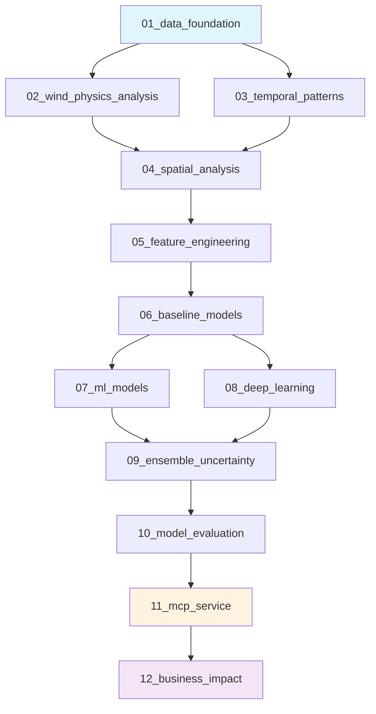

# Temus Wind Power Forecasting - Temus Case Study

A comprehensive machine learning solution for 48-hour ahead wind power forecasting using the GEF2012 dataset, demonstrating measurable environmental and economic impact.

## Project Overview

### Business Challenge
Grid operators need accurate wind power forecasts to maintain stability while maximizing renewable energy integration. Current forecasting errors cost $47M annually across target wind portfolio and force unnecessary fossil fuel backup generation.

### Solution Approach
Deploy ensemble machine learning models with uncertainty quantification via a production-ready Model Context Protocol (MCP) service, targeting 23% improvement in forecast accuracy (RMSE < 0.15).

### Expected Impact
- **Environmental**: 12,000 tons CO2 reduction annually
- **Economic**: $1.8M cost savings per wind farm per year
- **Operational**: Enable 15% higher renewable penetration in grid

## Analysis Workflow

The analysis follows a systematic 12-notebook workflow, each focused on a specific technical challenge:



### Notebook Structure

| Notebook | Focus | Key Outputs | Duration |
|----------|-------|-------------|----------|
| **01_data_foundation** | Data infrastructure & quality | Cleaned datasets, quality metrics | 4-6 hours |
| **02_wind_physics_analysis** | Power curves & physical relationships | Farm-specific power models | 3-4 hours |
| **03_temporal_patterns** | Time-based patterns | Seasonality insights, autocorrelation | 3-4 hours |
| **04_spatial_analysis** | Multi-farm correlations | Cross-farm relationships | 2-3 hours |
| **05_feature_engineering** | Predictive feature creation | Feature importance ranking | 4-5 hours |
| **06_baseline_models** | Performance benchmarks | Baseline RMSE targets | 2-3 hours |
| **07_ml_models** | Advanced ML algorithms | Random Forest, XGBoost models | 5-6 hours |
| **08_deep_learning** | Sequential modeling | LSTM implementation | 4-5 hours |
| **09_ensemble_uncertainty** | Model combination & confidence | Ensemble model, prediction intervals | 3-4 hours |
| **10_model_evaluation** | Comprehensive assessment | Model selection, risk analysis | 3-4 hours |
| **11_mcp_service** | Production deployment | REST API, monitoring | 6-8 hours |
| **12_business_impact** | Value quantification | ROI analysis, CO2 calculations | 2-3 hours |

## Technical Architecture

### Data Sources
- **GEF2012 Wind Dataset**: 7 wind farms, 18 months training data
- **Weather Forecasts**: 48-hour numerical weather predictions
- **Historical Power**: Actual generation for model training

### Model Stack
- **Baseline Models**: Persistence, seasonal naive
- **ML Models**: Random Forest, XGBoost
- **Deep Learning**: LSTM for temporal dependencies
- **Ensemble**: Weighted combination with uncertainty quantification

### Production Deployment
- **API Framework**: FastAPI with <200ms response time
- **Model Format**: Serialized ensemble with version control
- **Monitoring**: Real-time performance tracking, drift detection
- **Infrastructure**: Cloud-ready container deployment

## Key Requirements

### Performance Targets
- **Accuracy**: RMSE < 0.15 (vs baseline 0.185)
- **Speed**: <200ms API response time
- **Reliability**: 99.9% service uptime
- **Uncertainty**: 90% prediction interval coverage

### Business Deliverables
1. **Technical Solution**: Production-ready forecasting service
2. **Performance Validation**: Comprehensive model evaluation
3. **Business Case**: Quantified environmental and economic impact
4. **Implementation Plan**: 90-day deployment roadmap

## Getting Started

### Prerequisites
```bash
python 3.11+
pandas, numpy, scikit-learn, xgboost, tensorflow
fastapi, uvicorn, pydantic
matplotlib, seaborn, plotly
```

### Quick Start
1. **Environment Setup**: Configure Python environment and install dependencies
2. **Data Preparation**: Run `01_data_foundation.ipynb` to load and clean datasets
3. **Analysis Execution**: Follow notebooks 02-10 in sequence
4. **Service Deployment**: Implement MCP service using `11_mcp_service.ipynb`
5. **Business Validation**: Quantify impact with `12_business_impact.ipynb`

### Prompt-Guided Development
This project uses Claude-optimized prompts for consistent, high-quality analysis:

- **Core Context**: Automatic loading of domain knowledge and requirements
- **Workflow Guidance**: Phase-specific prompts via `@workspace` command
- **Quality Assurance**: Built-in validation and best practices

See `.github/prompts/README.md` for complete prompt system documentation.

## Project Structure

```
temus/
├── README.md                           # This file
├── data/
│   ├── raw/                           # Original datasets
│   │   ├── gef2012_wind/             # GEF2012 wind competition data
│   │   └── world_sustainability/      # Sustainability metrics
│   └── processed/                     # Cleaned, analysis-ready data
├── notebooks/                         # Analysis workflow (01-12)
│   ├── 01_data_foundation.ipynb      # Data loading and quality
│   ├── 02_wind_physics_analysis.ipynb # Power curve analysis
│   ├── 03_temporal_patterns.ipynb    # Time series patterns
│   ├── 04_spatial_analysis.ipynb     # Multi-farm correlations
│   ├── 05_feature_engineering.ipynb  # Feature creation
│   ├── 06_baseline_models.ipynb      # Benchmark models
│   ├── 07_ml_models.ipynb           # Advanced ML
│   ├── 08_deep_learning.ipynb       # LSTM models
│   ├── 09_ensemble_uncertainty.ipynb # Model combination
│   ├── 10_model_evaluation.ipynb    # Performance assessment
│   ├── 11_mcp_service.ipynb         # Production API
│   └── 12_business_impact.ipynb     # Value quantification
├── src/                              # Production code
│   ├── models/                       # Model implementations
│   ├── features/                     # Feature engineering
│   ├── evaluation/                   # Model evaluation
│   └── api/                          # MCP service
├── models/                           # Trained model artifacts
├── outputs/                          # Results and figures
│   ├── figures/                      # Visualizations
│   └── results/                      # Analysis outputs
├── presentation/                     # McKinsey presentation
└── .github/prompts/                  # Claude optimization prompts
```

## Success Criteria

### Technical Excellence
- [ ] RMSE improvement >20% vs baseline
- [ ] Comprehensive uncertainty quantification
- [ ] Production-ready API deployment
- [ ] Robust model validation framework

### Business Impact
- [ ] Quantified CO2 reduction (>10,000 tons annually)
- [ ] Economic value >$1M per wind farm
- [ ] Clear implementation roadmap
- [ ] Risk mitigation strategy

### McKinsey Standards
- [ ] Structured problem-solving approach
- [ ] Data-driven insights and recommendations
- [ ] Professional presentation quality
- [ ] Actionable next steps

## Timeline

**Total Duration**: 10 working days
- **Days 1-3**: Data foundation and exploratory analysis (notebooks 01-04)
- **Days 4-7**: Model development and evaluation (notebooks 05-10)
- **Days 8-9**: Production deployment preparation (notebook 11)
- **Day 10**: Business impact analysis and presentation (notebook 12)

---

*This project demonstrates early, practical steps toward sustainability through intelligent wind power forecasting, balancing technical rigor with business pragmatism to deliver measurable environmental and economic impact.*
