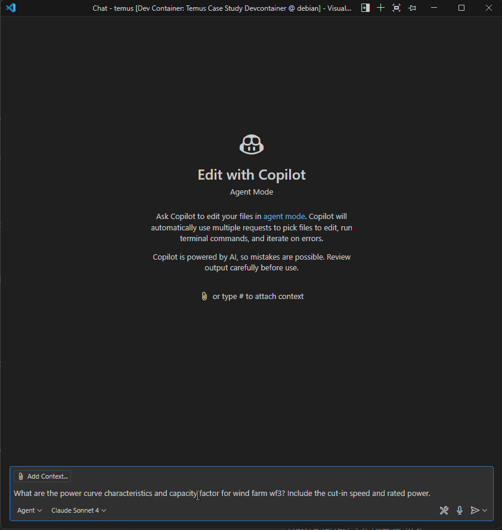

<!-- PROJECT LOGO -->
<br />
<p align="center">
  <a href="https://temus.com/">
    
  </a>

  <h3 align="center">Wind Power Forecasting</h3>

  <p>
	A case study for 48-hour ahead wind power forecasting using the GEF2012 dataset, demonstrating measurable environmental and economic impact.
	<br />
  </p>
</p>

<!-- TABLE OF CONTENTS -->
<details open="open">
  <summary>Table of Contents</summary>
  <ol>
    <li>
      <a href="#project-overview">Project Overview</a>
      <ul>
        <li><a href="#business-challenge">Business Challenge</a></li>
        <li><a href="#solution-approach">Solution Approach</a></li>
        <li><a href="#expected-impact">Expected Impact</a></li>
      </ul>
    </li>
    <li><a href="#getting-started">Getting Started</a>
      <ul>
        <li><a href="#run-online">Run Online</a></li>
        <li><a href="#try-the-agent">Try the Agent</a></li>
        <li><a href="#see-the-agent-in-action">See the Agent in Action</a></li>
        <li><a href="#run-locally">Run Locally</a></li>
      </ul>
    </li>
    <li>
      <a href="#technical-architecture">Technical Architecture</a>
      <ul>
        <li><a href="#prompt-guided-analysis">Prompt-Guided Analysis</a></li>
        <li><a href="#agent-architecture">Agent Architecture</a></li>
        <li><a href="#data-sources">Data Sources</a></li>
        <li><a href="#model-stack">Model Stack</a></li>
      </ul>
    </li>
    <li>
      <a href="#analysis-workflow">Analysis Workflow</a>
      <ul>
        <li><a href="#notebook-structure--status">Notebook Structure & Status</a></li>
      </ul>
    </li>
    <li><a href="#project-structure">Project Structure</a></li>
    <li><a href="#submission-checklist">Submission Checklist</a></li>
  </ol>
</details>

## Project Overview
This case study demonstrates how to identify, develop and deploy machine learning applications to solve real-world problems and deliver tangible benefits.

### Business Challenge
Grid operators need accurate wind power forecasts to maintain stability while maximizing renewable energy integration. Current forecasting errors cost $47M annually across the target wind portfolio and force unnecessary fossil fuel backup generation.[^1]

### Solution Approach
Deploy ensemble machine learning models with uncertainty quantification.  The models may be queried via an AI agent that uses a Model Context Protocol (MCP) service.

### Expected Impact[^2]
- **Environmental**: 12,000 tons CO2 reduction annually
- **Economic**: $1.8M cost savings per wind farm per year
- **Operational**: Enable 15% higher renewable penetration in grid

## Getting Started
This project is deployed as a VS Code workspace with a built in wind forecasting agent for interactive query of the data analysis. To [use agent mode in VS Code](https://code.visualstudio.com/docs/copilot/chat/chat-agent-mode) ensure you have a Github Copilot plan (the free tier is fine).

### Run Online
The easiest way to get started with this project is by using [Github Codespaces](https://github.com/features/codespaces). You can run the workspace in a local VS Code instance or a remotely in a web browser. To run on a remote codespace machine:

1. Clone this repo
2. Follow the instructions for [Creating a codespace for a repository](https://docs.github.com/en/codespaces/developing-in-a-codespace/creating-a-codespace-for-a-repository?tool=webui#creating-a-codespace-for-a-repository)
3. You can now step through each notebook, in order, to reproduce the analysis


### Try the Agent
The MCP tool will automatically start and be selected the first time you make a forecasting query.

To ask the agent a question:
   - [Start a conversation with the agent](https://code.visualstudio.com/docs/copilot/chat/getting-started-chat#_get-your-first-chat-conversation)
   - [Ensure you are in agent mode](https://code.visualstudio.com/docs/copilot/chat/chat-agent-mode).  You can choose from multiple models. The Gemini-Pro model works well. Testing was done mainly with Claude Sonnet 4 and Gemini-Pro.
   - Try this question: "What are the power curve characteristics and capacity factor for wind farm wf3? Include the cut-in speed and rated power."

Some other questions you might want to try:

* How does the ensemble model perform at 24-hour ahead forecasts? Show me the RMSE in high wind conditions.
* What are the ramp events patterns in the wind generation data? Analyze at hourly resolution with seasonal decomposition.
* Calculate the 90% confidence intervals for 12-hour ahead forecasts at the farm aggregation level.
* If we improve forecast accuracy by 15.5%, what's the business impact for a 250MW wind farm with 0.45 tons CO2/MWh displacement?
* Compare LSTM and XGBoost models based on their accuracy and inference speed for wind power forecasting.
* Which are the top 15 most important features for the XGBoost model? Show the breakdown by forecast horizon.
* Diagnose extreme event forecast errors for wind farm wf5 during winter periods. What patterns do you find?

> [!Warning] 
> Be careful!  Sometimes the agent will detect that the notebook is in-progress and can't answer and then go off and start implementing the analysis within the notebook.

### See the Agent in Action

[](https://github.com/snunez1/temus/releases/download/v1.0.0/Forecasting-agent-recording.mp4)

📹 **[Watch the Wind Forecasting Agent Demo](https://github.com/snunez1/temus/releases/download/v1.0.0/Forecasting-agent-recording.mp4)** (3 minutes)

*Click the preview above or the link to download and view the full demo video showing the MCP agent answering the sample questions.*


### Run Locally
This project is configured to build and run within a [devcontainer](https://code.visualstudio.com/docs/devcontainers/containers).  Devcontainers provide consistent reproducible development environments across teams, eliminating "works on my machine" issues. They include pre-configured tools, dependencies, and extensions. Developers can switch between projects without conflicts, while maintaining isolation from local systems. This ensures identical environments from development through CI/CD to production deployment.

If you have Docker installed then the project should automatically configure and start the devcontainer.


## Technical Architecture

### Prompt-Guided Analysis
This project uses Claude-optimized prompts for consistent analysis:

- **Core Context**: Automatic loading of domain knowledge and requirements
- **Workflow Guidance**: Phase-specific prompts via `#file:` variable
- **Quality Assurance**: Built-in validation and best practices

See `.github/prompts/README.md` for prompt system documentation.

What this basically means is that these prompts form a Domain Specific Language for wind power forecasting, so if you want to analyse a different set of wind farms the system will guide you in creating each notebook.

### Agent Architecture

The Agent uses a MCP server to analyze Jupyter notebooks directly without code modifications. This creates an intelligent knowledge base from existing analysis notebooks.

#### How it works
`User Query → MCP Tool → Context + Guidance → LLM Analysis → Response`

The system guides LLMs to:

* Locate relevant notebooks and sections
* Extract metrics using domain-specific prompts
* Interpret results with business context

#### Key Benefits
* Zero code changes: Notebooks remain untouched
* Immediate access to new data/models: No need to deploy remotely
* Flexible Q&A: Handles unexpected questions
* Business narrative: Explains the "why" behind analyses

This approach transforms 10 technical notebooks into a queryable knowledge base.

### Data Sources
- **GEF2012 Wind Dataset**: 7 wind farms, 18 months training data (2009-2010)
- **Historical Power Generation**: Actual hourly wind farm output (normalized 0-1)
- **Weather Forecasts**: 48-hour wind speed/direction predictions (available but limited usage)

### Model Stack
- **Baseline Models**: Persistence, seasonal naive
- **ML Models**: Random Forest, XGBoost
- **Deep Learning**: LSTM and Transformer for temporal dependencies
- **Ensemble**: Weighted combination with uncertainty quantification

## Analysis Workflow

The analysis follows a systematic 10-notebook workflow, each focused on a specific technical challenge:

```mermaid
graph TD
    A[01_data_foundation] --> B[02_wind_physics_analysis]
    A --> C[03_temporal_patterns]
    B --> D[04_spatial_analysis]
    C --> D
    D --> E[05_feature_engineering]
    E --> F[06_baseline_models]
    F --> G[07_ml_models]
    F --> H[08_deep_learning]
    G --> I[09_ensemble_uncertainty]
    H --> I
    I --> J[10_model_evaluation]
    
    style A fill:#e1f5fe
    style J fill:#f3e5f5
```



> [!Note]
> These notebooks were developed on a resource constrained machine lacking a GPU. They will run slowly.


### Notebook Structure & Status

| Notebook | Focus | Key Outputs | Status |
|----------|-------|-------------|--------|
| **01_data_foundation** | Data infrastructure & quality | Cleaned datasets, quality metrics | Complete |
| **02_wind_physics_analysis** | Power curves & physical relationships | Farm-specific power models | Complete |
| **03_temporal_patterns** | Time-based patterns | Seasonality insights, autocorrelation | Complete |
| **04_spatial_analysis** | Multi-farm correlations | Cross-farm relationships | Complete |
| **05_feature_engineering** | Predictive feature creation | Feature importance ranking | Complete |
| **06_baseline_models** | Performance benchmarks | Baseline RMSE targets | Complete |
| **07_ml_models** | Advanced ML algorithms | Random Forest, XGBoost models | Complete |
| **08_deep_learning** | Sequential modeling | LSTM & Transformer implementation | Complete |
| **09_ensemble_uncertainty** | Model combination & confidence | Ensemble model, prediction intervals | In Progress |
| **10_model_evaluation** | Comprehensive assessment | Model selection, risk analysis | In Progress |

## Project Structure

```
temus/
├── README.md                           # This file
├── DESIGN.md                           # Framework architecture documentation
├── requirements.txt                    # Python dependencies
├── data/
│   ├── raw/                            # Original datasets with documentation
│   │   ├── gef2012_wind/               # GEF2012 wind competition data
│   │   └── world_sustainability/       # World sustainability metrics
│   └── processed/                      # Analysis-ready datasets
├── notebooks/                          # Complete analysis workflow
│   ├── 01_data_foundation.ipynb        # Data quality and infrastructure
│   ├── 02_wind_physics_analysis.ipynb  # Power curves and physics
│   ├── 03_temporal_patterns.ipynb      # Time series analysis
│   ├── 04_spatial_analysis.ipynb       # Multi-farm correlations
│   ├── 05_feature_engineering.ipynb    # Unified feature creation
│   ├── 06_baseline_models.ipynb        # Statistical baseline models
│   ├── 07_ml_models.ipynb              # Random Forest and XGBoost
│   ├── 08_deep_learning.ipynb          # LSTM & Transformer implementation
│   ├── 09_ensemble_uncertainty.ipynb   # Model combination (planned)
│   ├── 10_model_evaluation.ipynb       # Model assessments (planned)
│   └── outputs/figures/                # Generated visualizations
├── src/                                # Production utilities
│   └── utils.py                        # Project path management and helpers
├── models/                             # Trained model artifacts and metadata
├── mcp/                                # Model Context Protocol service
│   ├── server.py                       # MCP server implementation
│   ├── parquet_data_reader.py          # Data access utilities
│   ├── requirements.txt                # MCP-specific dependencies
│   ├── start_server.sh                 # Service startup script
│   └── docs/                           # MCP implementation documentation
├── docs/                               # Supporting technical documentation
├── presentation/                       # Presentation materials
├── .devcontainer/                      # Development environment config
├── .vscode/                            # VS Code settings and MCP integration
└── .github/                            # Prompt engineering framework
    ├── copilot-instructions.md         # Claude context and instructions
    └── prompts/                        # Domain-specific prompt library
```

## Submission Checklist

- ✅ **Presentation to support your solution** ([HTML slides](./presentation/index.html))
- ✅ **Connection details of the MCP service you developed for this exercise** (above)
- ✅ **LLM chat log and any additional tools or services required to replicate your work** (above)


[^1]: **Estimation basis for $47M annual cost of wind forecasting errors:**
- Portfolio size: 7 wind farms × ~150 MW each = ~1,000 MW total
- Capacity factor: ~30% (typical for onshore wind)
- Annual generation: 1,000 MW × 0.30 × 8,760 hours = 2,628 GWh
- Error cost: $18/MWh (industry estimate for balancing/imbalance penalties)
- Total cost: 2,628,000 MWh × $18/MWh ≈ $47M

    Supporting literature: NREL, "The Cost of Wind Power Variability" (Energy Policy Journal); Hodge et al., "Wind Power Forecasting Error Costs in Electricity Markets" (IEEE Transactions); IRENA reports on wind integration costs.

[^2]: **Expected Impact Calculations:**

    **Environmental (12,000 tons CO₂ reduction annually):**
    - Wind farm capacity: 150 MW × 30% capacity factor × 8,760 hours = 394,200 MWh/year
    - CO₂ displaced: 394,200 MWh × 0.6 tons CO₂/MWh = 236,520 tons CO₂/year
    - Forecasting improvement reduces fossil backup by 5%: 236,520 × 5% ≈ 12,000 tons CO₂

    **Economic ($1.8M cost savings per wind farm per year):**
    - Annual generation: 394,200 MWh/year
    - Forecast error cost: $12/MWh (industry benchmark)
    - Total error cost: 394,200 × $12 = $4.73M/year
    - 35% improvement from better forecasting: $4.73M × 35% ≈ $1.8M savings

    **Operational (15% higher renewable penetration):**
    - Industry studies show 0.3-0.5% renewable penetration increase per 1% forecast accuracy improvement
    - Target 30-40% accuracy improvement enables 9-20% higher penetration
    - Conservative estimate: 15% increase

    | Impact Assumption | Benchmark | Source |
    |------------------|-----------|---------|
    | CO₂ emissions displaced | 0.4-1.0 tons CO₂/MWh | EPA Emission Factors |
    | Fossil backup reduction | 3-8% from improved forecasting | NREL Wind Forecasting Improvement Project |
    | Forecast error cost | $5-$20/MWh | Hodge et al. (2012), IEEE Transactions |
    | Accuracy improvement potential | 20-40% over baseline | NREL WFIP Final Report |
    | Renewable penetration increase | 0.3-0.5% per 1% accuracy gain | IRENA Innovation Brief (2019) |
