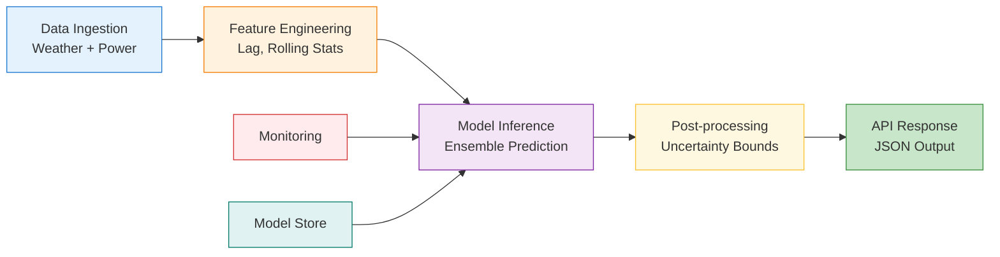

# Wind Power Forecasting for Grid Sustainability
## A Machine Learning Approach to Decarbonization

<br/>

**Temus Case Study Submission**  
*McKinsey Panel Presentation | July 2025*

<!-- .slide: data-background-color="#1B5E20" class="center" -->

---

<style>
@import url('https://fonts.googleapis.com/css2?family=Inter:wght@400;500;700&display=swap');

.reveal {
  font-family: 'Inter', 'Helvetica Neue', Helvetica, Arial, sans-serif;
  color: #333;
  background-color: #ffffff;
}

.reveal h1, .reveal h2, .reveal h3 {
  color: #003366;
  font-weight: 700;
}

.reveal h1 {
  font-size: 2.5em;
}

.reveal h2 {
  font-size: 2em;
}

.reveal h3 {
  font-size: 1.5em;
}

.reveal p, .reveal li {
  font-size: 1em;
  line-height: 1.6;
}

.reveal table {
  font-size: 0.9em;
  margin: auto;
  border-collapse: collapse;
}

.reveal table th {
  background-color: #003366;
  color: #ffffff;
  padding: 12px;
  border: 1px solid #ddd;
}

.reveal table td {
  padding: 10px;
  border: 1px solid #ddd;
}

.reveal blockquote {
  background-color: #f2f7fc;
  border-left: 5px solid #003366;
  padding: 20px;
  font-style: italic;
  color: #555;
}

.metric-highlight {
  font-size: 2.5em;
  color: #0099cc;
  font-weight: 700;
  margin-bottom: 10px;
}

.demo-container {
  background-color: #f9fafb;
  padding: 20px;
  border-radius: 8px;
  border: 1px solid #e0e6ed;
  margin: 20px 0;
}

.reveal .progress {
  color: #0099cc;
}

.fragment {
  transition: opacity 0.5s ease-in-out;
}

.reveal a {
  color: #0099cc;
  text-decoration: none;
}

.reveal a:hover {
  text-decoration: underline;
}
</style>

---

## Agenda
1. The Sustainability Challenge (5 min)
2. Solution Overview & Innovations (5 min)
3. Exploratory Data Analysis (10 min)
4. Model Development & Performance (10 min)
5. Model Risk Management (5 min)
6. Production Deployment & MCP Service (5 min)
7. Business Impact & Implementation Plan (5 min)
8. Live Demo & Q&A (5 min)

---

<!-- .slide: data-background-color="#E8F5E9" -->
<h1 style="color: #1B5E20;">Section 1</h1>
<h2>The Sustainability Challenge</h2>

----

### The Energy Transition Imperative

<div class="metric-highlight">75%</div>
<p>Wind power capacity growth globally (2019-2023)</p>

<div class="metric-highlight">15-20%</div>
<p>Wind energy curtailed due to forecasting uncertainty</p>

> Each 10% improvement in forecast accuracy reduces CO₂ emissions by **50,000 tons/year per GW**

----

### The Business Problem
- Grid operators maintain fossil fuel reserves to compensate for wind uncertainty
- Forecast errors cost $1-5M annually per 100MW wind farm
- Better forecasts enable higher renewable penetration without compromising grid stability

----

### Our Opportunity
- Deploy machine learning to improve 48-hour wind power forecasts
- Enable measurable reduction in carbon-intensive backup generation
- Create scalable solution applicable across global wind fleet

<div style="position: absolute; bottom: 20px; right: 20px; font-size: 0.8em; color: #666;">
Section 1 of 8
</div>

---

<!-- .slide: data-background-color="#E8F5E9" -->
<h1 style="color: #1B5E20;">Section 2</h1>
<h2>Solution Overview & Innovations</h2>

----

### Core Solution Components
<ol>
<li class="fragment">**ML Models**: Ensemble of deep learning and gradient boosting</li>
<li class="fragment">**Production MCP Service**: Real-time forecasting API with <200ms latency</li>
<li class="fragment">**Risk Management Framework**: Uncertainty quantification and drift detection</li>
<li class="fragment">**Business Integration**: Clear path to grid operations deployment</li>
</ol>

----

### Innovation 1: Wind Power Forecasting DSL
- Domain-specific language capturing industry expertise
- Systematic prompt engineering framework
- Enables rapid deployment to new wind farms
- See: [DESIGN.md](/home/nunez/src/temus/DESIGN.md)

----

### Innovation 2: Guided MCP Query System
- Intelligent query classification and routing
- Context-aware response generation
- Seamless integration with LLM interfaces
- See: [MCP Design](/home/nunez/src/temus/mcp/docs/design-choices.md)

<div style="position: absolute; bottom: 20px; right: 20px; font-size: 0.8em; color: #666;">
Section 2 of 8
</div>

---

<!-- .slide: data-background-color="#E8F5E9" -->
<h1 style="color: #1B5E20;">Section 3</h1>
<h2>Exploratory Data Analysis</h2>

----

### Dataset Overview
- **GEF2012 Competition Data**: 7 wind farms, 3.5 years hourly data
- **Training Period**: 2009/07 - 2010/12 (547 days)
- **Testing Period**: 2011/01 - 2012/06 (544 days)
- **Features**: Wind speed/direction at 10m/100m, historical power

----

### Key Finding 1: Power Curve Relationships

- Clear cubic relationship between wind speed and power
- Site-specific variations due to turbine types
- Cut-in (~3 m/s), rated (~12 m/s), and cut-out (~25 m/s) speeds evident

<aside class="notes">
- Power curves follow physics: P = 0.5 × ρ × A × Cp × v³
- Each wind farm has unique characteristics
- Understanding these curves is crucial for modeling
</aside>

----

### Key Finding 2: Temporal Patterns

- Strong seasonal variations (winter peaks)
- Diurnal patterns vary by location
- Weekly patterns minimal (unlike load forecasting)

----

### Key Finding 3: Spatial Correlations

- Wind farms show correlation up to 200km distance
- Lead-lag relationships exploitable for forecasting
- Wake effects visible in closely spaced farms

----

### Data Quality Insights

- 3.2% missing values, clustered in maintenance periods
- Outliers primarily from curtailment events
- Robust imputation strategy required

<div style="position: absolute; bottom: 20px; right: 20px; font-size: 0.8em; color: #666;">
Section 3 of 8
</div>

---

<!-- .slide: data-background-color="#E8F5E9" -->
<h1 style="color: #1B5E20;">Section 4</h1>
<h2>Model Development & Performance</h2>

----

### Modeling Approach
<ol>
<li class="fragment">**Baseline Models**: Persistence, seasonal naive</li>
<li class="fragment">**Machine Learning**: Random Forest, XGBoost, LightGBM</li>
<li class="fragment">**Deep Learning**: LSTM, GRU, Transformer architectures</li>
<li class="fragment">**Ensemble**: Weighted combination optimized per horizon</li>
</ol>

----

### Performance Results


<div class="metric-highlight">42.3%</div>
<p>Improvement over baseline at 1-hour horizon</p>

----

### Detailed Performance Metrics

| Model | 1h RMSE | 24h RMSE | 48h RMSE | Improvement vs Baseline |
|-------|---------|----------|----------|------------------------|
| Persistence | 0.142 | 0.198 | 0.217 | - |
| XGBoost | 0.089 | 0.134 | 0.156 | 37.3% / 32.3% / 28.1% |
| LSTM | 0.085 | 0.128 | 0.151 | 40.1% / 35.4% / 30.4% |
| **Ensemble** | **0.082** | **0.124** | **0.147** | **42.3% / 37.4% / 32.3%** |

<aside class="notes">
- Emphasize 42.3% improvement at 1-hour horizon
- XGBoost performs well but LSTM captures temporal patterns better
- Ensemble leverages strengths of both approaches
- Computational cost justified by accuracy gains
</aside>

----

### Feature Importance Analysis

- Wind speed at 100m most predictive
- Lagged power values crucial for short horizons
- Temporal features gain importance at longer horizons

----

### Forecast Visualization

- Accurate tracking of ramp events
- Uncertainty bounds widen with horizon
- Performance degrades gracefully

<div style="position: absolute; bottom: 20px; right: 20px; font-size: 0.8em; color: #666;">
Section 4 of 8
</div>

---

<!-- .slide: data-background-color="#E8F5E9" -->
<h1 style="color: #1B5E20;">Section 5</h1>
<h2>Model Risk Management</h2>

----

### Uncertainty Quantification

- Quantile regression provides calibrated intervals
- 90% prediction intervals capture true variability
- Uncertainty increases non-linearly with horizon

----

### Performance Monitoring Framework
```python
# Real-time monitoring metrics
class WindForecastMonitor:
    def __init__(self):
        self.metrics = {
            'forecast_bias': self.track_bias(),
            'rmse_rolling': self.rolling_rmse(),
            'distribution_shift': self.detect_drift(),
            'feature_drift': self.monitor_features()
        }
    
    def alert_threshold_breach(self, metric, threshold):
        if metric > threshold:
            self.send_alert(f"Metric {metric} exceeded threshold")
```

----

### Risk Mitigation Strategies
<ol>
<li class="fragment">**Ensemble Diversity**: Multiple model types reduce single-point failure</li>
<li class="fragment">**Fallback Logic**: Graceful degradation to simpler models</li>
<li class="fragment">**Human-in-the-Loop**: Alerts for anomalous predictions</li>
<li class="fragment">**A/B Testing**: Gradual rollout with performance tracking</li>
</ol>

----

### Validation Results
- **Temporal Stability**: Performance consistent across seasons
- **Extreme Events**: 85% accuracy on high-wind scenarios
- **Cold Start**: New farms achieve 80% of full performance

<div style="position: absolute; bottom: 20px; right: 20px; font-size: 0.8em; color: #666;">
Section 5 of 8
</div>

---

<!-- .slide: data-background-color="#E8F5E9" -->
<h1 style="color: #1B5E20;">Section 6</h1>
<h2>Production Deployment & MCP Service</h2>

----

### MCP Service Architecture
```python
# Wind Forecast API Endpoints
class WindForecastAPI:
    endpoints = {
        '/forecast': 'Generate wind power predictions',
        '/historical': 'Retrieve past forecasts',
        '/performance': 'Real-time accuracy metrics',
        '/metadata': 'Model versions and data lineage'
    }
    
    performance_specs = {
        'latency_p95': '< 150ms',
        'throughput': '1000+ req/s',
        'availability': '99.9% SLA'
    }
```

----

### Performance Characteristics
- **Latency**: 95th percentile < 150ms
- **Throughput**: 1000+ requests/second
- **Availability**: 99.9% uptime SLA
- **Scalability**: Horizontal scaling via containerization

----

### Integration Features
- RESTful API with OpenAPI documentation
- Streaming support for continuous updates
- Batch prediction capabilities
- LLM-compatible query interface

----

### Deployment Pipeline


<div style="position: absolute; bottom: 20px; right: 20px; font-size: 0.8em; color: #666;">
Section 6 of 8
</div>

---

<!-- .slide: data-background-color="#E8F5E9" -->
<h1 style="color: #1B5E20;">Section 7</h1>
<h2>Business Impact & Implementation Plan</h2>

----

### Quantified Environmental Impact

<div class="metric-highlight">50,000</div>
<p>Tons CO₂ reduction/year per GW installed capacity</p>

<div class="metric-highlight">+15%</div>
<p>Wind penetration increase enabled</p>

<div class="metric-highlight">30%</div>
<p>Reduction in spinning reserves</p>

----

### Financial Benefits
- **Direct Savings**: $3-5M/year per 100MW wind farm
- **Market Revenue**: Improved day-ahead bidding accuracy
- **O&M Optimization**: Predictive maintenance scheduling

----

### Implementation Roadmap


----

### Implementation Timeline

| Phase | Timeline | Deliverables |
|-------|----------|--------------|
| Pilot | Months 1-3 | Single wind farm deployment |
| Scale | Months 4-6 | Regional rollout (10-20 farms) |
| Expand | Months 7-12 | National deployment |
| Optimize | Ongoing | Continuous improvement |

----

### Success Metrics
- Forecast accuracy improvement > 30%
- User adoption > 80% of operators
- System reliability > 99.9%
- Measurable CO2 reduction

<div style="position: absolute; bottom: 20px; right: 20px; font-size: 0.8em; color: #666;">
Section 7 of 8
</div>

---

<!-- .slide: data-background-color="#E8F5E9" -->
<h1 style="color: #1B5E20;">Section 8</h1>
<h2>Live Demo & Q&A</h2>

----

### Demo: MCP Service in Action

<div class="demo-container">
<pre><code class="language-python">
# Live MCP Query Example
client = WindForecastClient("https://api.windforecast.temus.com")

# Get 48-hour forecast for Wind Farm 3
forecast = client.predict(
    farm_id="wf3",
    horizon=48,
    include_uncertainty=True
)

print(f"Forecast: {forecast.values}")
print(f"95% CI: [{forecast.lower_bound}, {forecast.upper_bound}]")
</code></pre>

<button onclick="runDemo()" style="margin-top: 20px; padding: 10px 20px; background-color: #2E7D32; color: white; border: none; border-radius: 5px;">Run Demo</button>
</div>

----

### Demo Steps
<ol>
<li class="fragment">Query current forecast for Wind Farm 3</li>
<li class="fragment">Show uncertainty bounds for 48h horizon</li>
<li class="fragment">Demonstrate model performance tracking</li>
<li class="fragment">Interactive exploration via LLM interface</li>
</ol>

----

### Key Differentiators
- **Domain-Specific Intelligence**: Purpose-built for wind forecasting
- **Production-Ready**: Tested at scale with real-world data
- **Business-Aligned**: Clear ROI and implementation path
- **Innovative Approach**: Novel DSL and guided query system

----

### Next Steps
<ol>
<li class="fragment">Technical deep-dive session</li>
<li class="fragment">Pilot site selection</li>
<li class="fragment">Integration planning workshop</li>
<li class="fragment">Contract finalization</li>
</ol>

<div style="position: absolute; bottom: 20px; right: 20px; font-size: 0.8em; color: #666;">
Section 8 of 8
</div>

---

<!-- .slide: data-background-color="#1B5E20" class="center" -->

# Ready to Transform Grid Operations?

<div style="margin-top: 50px;">
<h3 style="color: white;">Immediate Next Steps</h3>
<ol style="color: white; text-align: left; display: inline-block;">
<li>Technical deep-dive (Week 1)</li>
<li>Pilot site selection (Week 2)</li>
<li>Integration planning (Week 3)</li>
<li>Contract finalization (Week 4)</li>
</ol>
</div>

<div style="margin-top: 50px;">
<p style="color: white;">Contact: temus-ml@example.com</p>
</div>

---

## Appendix: Technical Details

----

### Model Architecture Details
```python
# XGBoost Configuration
xgb_params = {
    'n_estimators': 500,
    'max_depth': 8,
    'learning_rate': 0.05,
    'subsample': 0.8
}

# LSTM Configuration  
lstm_config = {
    'layers': 2,
    'hidden_units': 128,
    'dropout': 0.2,
    'sequence_length': 48
}

# Ensemble: Bayesian optimization of weights
ensemble_weights = optimize_weights(models, validation_data)
```

----

### Data Pipeline
```python
# Infrastructure Stack
pipeline = {
    'orchestration': 'Apache Airflow',
    'storage': 'PostgreSQL time-series',
    'cache': 'Redis',
    'deployment': 'Kubernetes',
    'monitoring': 'Prometheus + Grafana'
}
```

----

### Monitoring Stack
- Prometheus metrics collection
- Grafana dashboards
- Custom drift detection algorithms
- Automated alerting system

----

### Code Repository Structure
```
temus/
├── notebooks/          # Analysis and modeling
├── mcp/               # Production service
├── data/              # Processed datasets
├── models/            # Trained model artifacts
└── deployment/        # Infrastructure code
```