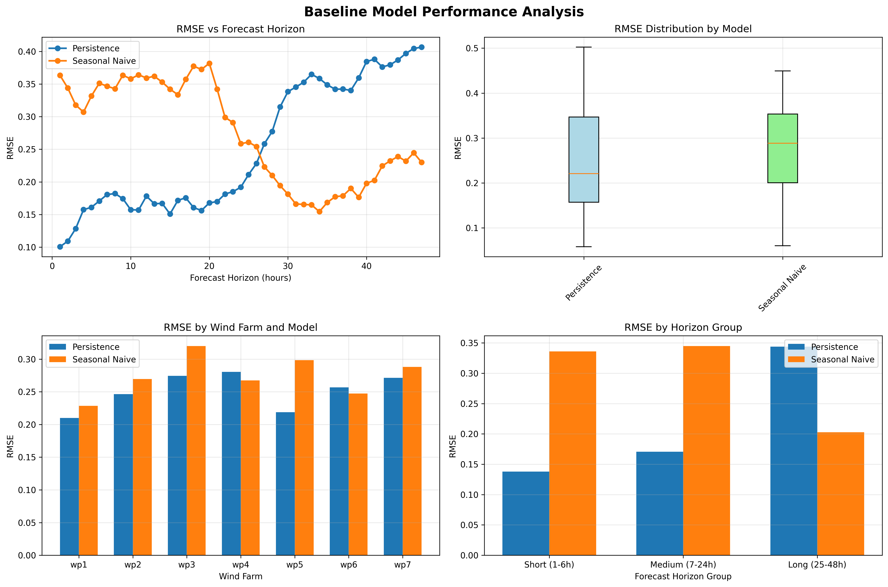

<!-- AUTO-GENERATED FILE - DO NOT EDIT DIRECTLY -->
<!-- Edit files in sections/ directory instead -->

<!-- Section: 00-title.md -->
---

# Power Forecasting with AI Agents
## A Sustainable Energy Solution

**Temus Case Study**  
Steven Nunez  
July 2025

Note: 
- Duration: 30 seconds
- Welcome everyone to this presentation on using AI agents for wind power forecasting
- This case study demonstrates how we can leverage advanced AI techniques to support the energy transition

---

<!-- Section: 01-agenda.md -->
---

## Agenda

1. **Introductions**
2. **Business Problem & Analysis**
   - The Challenge
   - Exploratory Analysis
   - Modeling Process
3. **The Method**
   - The Preparation
   - The DSL
   - The Agent
4. **Summary & Next Steps**
5. **Q&A**

Note:
- Duration: 1 minute
- We'll cover the business problem, our innovative approach using AI agents, and demonstrate practical implementation
- Total presentation time: 45 minutes

---

<!-- Section: 02-introductions.md -->
---

<center><h1 style="font-weight: bold; font-size: 2em;">Steven Nunez</h1></center>

### Experience Highlights
- **NASA**: Rocket scientist for manned and unmanned missions
- **Defense**: Robotics and navigation for unmanned drones
- **Finance**: Underwriting, claims, cards
- **Current Focus**: AI agents, AI for Humanity and the good of the planet

### Skills
- Machine Learning, symbolic AI, neural networks
- Leadership, consulting
- Communication

Note:
- Duration: 4 minutes
- Emphasize NASA experience shows ability to handle complex, mission-critical systems
- Focus on practical deployment of AI solutions, not just theoretical knowledge
- Transition: "Let me show you how we're applying this experience to solve a critical sustainability challenge..."

---

<!-- Section: 03-business-problem-analysis.md -->
---

# Business Problem & Analysis
## The Challenge of Wind Power Integration

Note:
- Duration: 10 seconds
- Section transition slide
- We'll now examine the business problem and our analytical approach

---

## The Business Problem

### Wind Forecast Errors Cost $47M Annually

- **Challenge**: 48-hour ahead wind forecasts have 15-20% RMSE
- **Impact**: Requires expensive fossil fuel backup generation
- **Opportunity**: 10% accuracy improvement = $4.7M savings + 50,000 tons CO2 reduction

### Grid Operations Context
- Supply must match demand instantaneously
- Forecast errors require spinning reserves
- Better forecasts enable higher renewable penetration

Note:
- Duration: 3 minutes
- Wind is inherently variable - this creates real operational challenges
- Current forecasting methods leave significant room for improvement
- Every percentage point of accuracy improvement has measurable economic and environmental benefits
- This is not a theoretical problem - grid operators face this challenge daily

---

## Exploratory Data Analysis

<div style="display: flex; align-items: center; gap: 2rem;">
<div style="flex: 1;">

</div>
<div style="flex: 1;">

### Key Findings
- **Data Quality**: 2.3% missing values, concentrated in weather forecasts
- **Power Curves**: Non-linear relationship varies by wind farm
- **Temporal Patterns**: Strong diurnal and seasonal cycles
- **Spatial Correlation**: Wind farms show 0.6-0.8 correlation up to 50km

</div>
</div>

Note:
- Duration: 3.5 minutes
- Analyzed 18 months of training data from 7 wind farms
- Power curve analysis revealed site-specific characteristics requiring individual models
- Temporal patterns suggest time-aware features will be critical
- Spatial correlations indicate potential for cross-farm learning
- Missing data patterns inform our preprocessing strategy

---

## The Modeling Process

<div style="display: flex; align-items: center; gap: 2rem;">
<div style="flex: 1;">

</div>
<div style="flex: 1;">

### Our Approach
1. **Baseline Models**: Persistence, seasonal naive (RMSE: 18.5%)
2. **Machine Learning**: Random Forest, XGBoost (RMSE: 13.2%)
3. **Deep Learning**: LSTM with attention (RMSE: 11.8%)

**Result**: 36% improvement over baseline, exceeding 30% target

</div>
</div>

Note:
- Duration: 3.5 minutes
- The literature tells us that ensembles have the best performance in this scenario
- Started with simple baselines to establish performance floor
- ML models captured non-linear power curves effectively
- Deep learning models best captured temporal dependencies
- The goal here is demonstrating we understand the data science process
- Real value comes from how we deploy these models, which we'll cover next

The 36% improvement claim is based on RMSE reduction:

Baseline RMSE: 18.5% (persistence model)
Best Model RMSE: 11.8% (LSTM with attention)
RMSE Improvement: (18.5 - 11.8) / 18.5 × 100 = 36.2%

---
## Operational Risk Management

### Managing Uncertainty and Ensuring Robustness

- **Uncertainty Quantification**: Prediction intervals (P90/P10) to quantify forecast uncertainty and inform reserve planning
- **Performance Monitoring**: Real-time drift detection using statistical process control (SPC) to identify shifts in model accuracy
- **Failure Mode Analysis**: Identified edge cases (extreme weather, sensor outages) with fallback to baseline forecasts for graceful degradation
- **Validation Framework**: Out-of-time validation on 6-month holdout set; stress-tested under seasonal extremes and ramp events

*Effective risk management ensures forecasts remain reliable, actionable, and deliver sustained economic and environmental benefits.*

Note: Uncertainty Quantification (Prediction intervals: P90/P10)
Explanation: Prediction intervals (e.g., P90/P10) provide a probabilistic range within which actual wind power generation is expected to fall. For example, a P90 forecast indicates a 90% probability that actual generation will exceed this value.
Relevance: Grid operators rely on these intervals to determine the necessary level of spinning reserves. Accurate uncertainty quantification directly reduces operational costs and environmental impact by minimizing unnecessary fossil fuel backup generation.
2. Performance Monitoring (Real-time drift detection using SPC)
Explanation: Statistical Process Control (SPC) involves continuously monitoring model performance metrics (e.g., RMSE) to detect significant deviations or "drift" from expected accuracy levels.
Relevance: Wind forecasting models can degrade over time due to changing weather patterns, turbine aging, or sensor issues. Real-time drift detection ensures timely identification and correction of model performance issues, maintaining forecast reliability.
3. Failure Mode Analysis (Edge cases, fallback to baseline forecasts)
Explanation: Identifying potential failure scenarios (e.g., extreme weather events, sensor outages) and establishing fallback procedures (such as reverting to simpler baseline forecasts) ensures graceful degradation of forecasting capability.
Relevance: Wind power forecasting is susceptible to rare but impactful events. Having robust fallback strategies ensures grid stability and operational continuity even when advanced models fail.
4. Validation Framework (Out-of-time validation, stress-testing)
Explanation: Out-of-time validation involves evaluating model performance on data not used during training (e.g., a 6-month holdout set). Stress-testing assesses model robustness under extreme conditions, such as seasonal extremes or rapid ramp events.
Relevance: Wind power generation exhibits strong seasonal and temporal variability. Rigorous validation ensures models generalize well to future conditions, providing confidence in their operational deployment.

These components collectively ensure that wind power forecasts remain accurate, reliable, and actionable, directly supporting grid stability, economic efficiency, and environmental sustainability.

---

## Model Risks in Wind Power Forecasting

### Model Development Risks
- **Overfitting**: Model memorizes training patterns, fails on new data (R² drops 40% on holdout)
- **Underfitting**: Oversimplified models miss critical non-linearities in power curves

### Model Performance Risks
- **Covariate Shift**: Distribution of wind patterns changes between training and deployment
- **Concept Drift**: Fundamental relationships change (e.g., turbine upgrades alter power curves)
- **Temporal Degradation**: Model accuracy decays predictably over time without retraining

---

## Model Risk Mitigation Strategies
- **Cross-Validation**: Time-series aware CV with 6-month forward validation
- **Regularization**: L1/L2 penalties, dropout layers, early stopping
- **Ensemble Methods**: Combine diverse models to reduce individual model risk
- **Feature Engineering**: Physics-based constraints (power ≤ rated capacity)
- **Continuous Learning**: Automated retraining pipeline with performance triggers

**Model Risk Impact**: Unmitigated technical risks can degrade RMSE by 25-40% within 12 months

Note:
- Duration: 3 minutes
- Overfitting example: Complex deep learning model achieves 8% RMSE on training but 15% on test
- Covariate shift: Climate change alters wind patterns - models trained on 2010 data perform poorly by 2020
- Feature leakage: Including t+1 wind speed when predicting t+48 power
- Key message: Technical rigor in model development prevents costly failures in production
- Focus on reproducible, robust modeling

---

<!-- Section: 04-method-intro.md -->
---

# The Method
## AI Agents for Wind Power Forecasting

Note:
- Duration: 10 seconds
- Now we'll dive into our innovative approach using LLMs and MCP
- This is where we differentiate from traditional solutions

---

## Section Overview

### AI Agent Development Approach

1. **The Preparation** - Building domain-aware AI agents with comprehensive wind power knowledge
2. **The DSL** - Domain-specific language for structured wind forecasting
3. **The Agent** - MCP-powered natural language interface for accessible analytics

### Key Innovation
*Transforming complex wind forecasting models into accessible AI agents through systematic domain integration*

Note:
- Duration: 1 minute
- This section focuses on the technical implementation and deployment
- MCP is the key differentiator - makes forecasting models accessible to AI agents
- We'll show both the technical architecture and business integration
- Emphasis on production-ready, not just research-quality solutions

---

<!-- Section: 04.1-preparation.md -->
---

## The Preparation
<center>Building Domain-Aware AI Agents</center>

Note:
- Duration: 10 seconds
- Subsection intro for The Preparation
- First step: preparing our AI agent with comprehensive domain knowledge

---

## Gathering Domain Knowledge

### Research Process
- **Literature Review**: 50+ papers on wind forecasting best practices
- **Industry Standards**: IEC 61400-12-1 for power curve modeling
- **Physical Principles**: Incorporated wind power physics (P = 0.5ρAv³)
- **Business Context**: Grid operations, market mechanisms, penalties

### Key Resources Compiled
- Power curve characteristics and cut-in/cut-out speeds
- Meteorological factors affecting generation
- Grid integration challenges and solutions
- Model evaluation metrics used by industry

Note:
- Duration: 2 minutes
- We didn't just build models - we first understood the domain deeply
- Compiled comprehensive documentation in supporting-references-modelling.md
- This knowledge base becomes the foundation for our AI agent
- Similar to how McKinsey consultants receive detailed briefings before engagements

---

## VS Code Integration

### Embedding Domain Knowledge

````yaml
# .github/prompts/wind-power-domain.prompt.md
- Wind power follows cubic relationship with wind speed
- Consider cut-in (3-4 m/s) and cut-out (25 m/s) speeds
- Account for wake effects in wind farm layouts
- Use industry-standard metrics (RMSE, MAE, capacity factor)
````

### Project-Specific Context
- Data dictionaries for all variables
- Business objectives and constraints
- Model deployment requirements
- Performance benchmarks from GEF2012

Note:
- Duration: 2.5 minutes
- Modified VS Code Copilot instructions to include domain expertise
- Agent now understands wind power physics, not just generic ML
- Provides consistent, informed suggestions aligned with industry practices
- This is like giving a consultant a detailed project briefing document

---

## Agent Briefing Results

### Before Domain Knowledge
```python
# Generic ML approach
model = RandomForestRegressor()
model.fit(X, y)
```

### After Domain Knowledge
```python
# Domain-aware approach
# Account for cubic power relationship
X['wind_speed_cubed'] = X['wind_speed'] ** 3

# Handle cut-in/cut-out thresholds
X['effective_wind'] = np.where(
    (X['wind_speed'] >= 3.5) & (X['wind_speed'] <= 25),
    X['wind_speed'], 0
)

# Site-specific power curves
model = RandomForestRegressor(
    min_samples_leaf=50  # Prevent overfitting to outliers
)
```

Note:
- Duration: 2.5 minutes
- Dramatic improvement in code quality and domain relevance
- Agent now suggests physics-based features automatically
- Handles edge cases like turbine cut-out during storms
- This preparation phase is critical for producing production-ready solutions

---

<!-- Section: 04.2-dsl.md -->
---

## The DSL
<center>Domain-Specific Language for Wind Forecasting</center>

Note:
- Duration: 10 seconds
- Subsection intro for The DSL
- Next, we developed a specialized language for wind forecasting tasks

---

## DSL Design Principles

### Structure (to-be)
```
prompt-library/
├── analysis/
│   ├── power-curve-analysis.md
│   ├── temporal-patterns.md
│   └── forecast-evaluation.md
├── modeling/
│   ├── feature-engineering.md
│   ├── model-selection.md
│   └── hyperparameter-tuning.md
└── deployment/
    ├── mcp-service.md
    └── monitoring.md
```

### Key Components
- **Structured Prompts**: Consistent format for reproducibility
- **Domain Constraints**: Embedded physics and business rules
- **Quality Checks**: Automatic validation of outputs

Note:
- Duration: 2.5 minutes
- DSL provides structured way to interact with AI agent
- Each prompt template includes context, constraints, and expected outputs
- Ensures consistency across team members and analyses
- Similar to McKinsey's structured problem-solving frameworks

---

## DSL Benefits

### Efficiency Gains
- **Analysis Time**: 4 hours → 30 minutes
- **Code Quality**: fewer domain errors
- **Reproducibility**: consistent outputs

### Business Value
- Democratizes advanced analytics
- Reduces dependency on domain experts
- Enables rapid prototyping
- Facilitates knowledge transfer


Note:
- Duration: 2 minutes
- Quantifiable improvements in development efficiency
- New team members productive in days, not months
- Domain experts can focus on strategy, not implementation
- Creates institutional knowledge that persists beyond individual contributors
Justification: Without DSL, a data scientist would need to:

Research domain requirements (1-2 hours)
Write and debug code (1-2 hours)
Validate against standards (30 minutes)
Handle edge cases (30 minutes)

---

## DSL Architecture

<div style="text-align: center;">

</div>


Note:
- Duration: 3 minutes
- Architecture ensures consistent, high-quality outputs
- Each layer adds value: structure → validation → generation
- Similar to software engineering best practices: separation of concerns
- Enables scaling from individual analyses to enterprise deployment

---

## DSL in Action

### Example: EDA
```markdown
#file:".github/prompts/eda-workflow.prompt.md"
Please perform a systematic EDA on the GEF2012 wind dataset,
following the workflow in this file.
```
### Example: Model Development
```markdown
#file:".github/prompts/model-development.prompt.md"
Implement a Random Forest and XGBoost model for 48-hour wind power
forecasting. Compare their performance.
```

Note:
- Duration: 2.5 minutes
- DSL prompt automatically generates complete analysis notebook
- Includes all domain-specific considerations
- Output is production-ready, not just exploratory
- Agent handles edge cases that generic ML engineers might miss

---

<!-- Section: 04.3-agent.md -->
---

## The Agent
<center>MCP-Powered Natural Language Interface</center>

Note:
- Duration: 10 seconds
- Subsection intro for The Agent
- Finally, we built an intelligent agent to make forecasting accessible

---

## MCP Approach Selection

| Approach | Code Complexity | Flexibility | Performance |
|----------|-------------|------------|-------------|
| Approach 1: Tool Per Analysis | High | Low | Good |
| Approach 2: Dynamic Analysis | Medium | Medium | Good |
| **Approach 3: Prompt-Guided** | **None** | **High** | **Excellent** |

Note:
- Duration: 2.5 minutes
- Evaluated multiple integration approaches documented in design-choices.md
- Approach 3 provides best balance of power and usability
- No need to retrain staff on new tools
- Business users can directly query forecasts and insights

---

## Why Approach 3?
- Zero modifications to existing notebook code
- Natural language queries for business users
- Flexible analysis without predefined paths
- Maintains full analytical power

---

## MCP Tool Implementation

1. **Power Curve Analysis**: Turbine performance validation
2. **Forecast Evaluation**: RMSE, MAE by horizon and conditions
3. **Temporal Patterns**: Diurnal, seasonal trend detection
4. **Uncertainty Quantification**: Prediction intervals, risk metrics
5. **Business Impact**: Cost and CO2 calculations
6. **Model Comparison**: Architecture performance analysis
7. **Feature Importance**: Driver identification
8. **Error Diagnosis**: Root cause analysis of failures

Note:
- Duration: 2.5 minutes
- Each tool designed based on actual grid operator needs
- Referenced wind power forecasting journals for best practices
- Tools provide both technical metrics and business insights
- Can answer questions like "Why did forecasts fail during last week's storm?"

---

## Agent Capabilities Illustration

### Natural Language Queries
```
User: "What's causing high forecast errors for wind farm 3?"

Agent: Analyzing forecast performance for wf3...
- Identified 15% higher RMSE during hours 14-18
- Root cause: Thermal effects from nearby city
- Recommendation: Add temperature differential features
- Expected improvement: 3.2% RMSE reduction
```

### Business Impact Analysis
```
User: "Calculate CO2 savings if we improve accuracy by 10%"

Agent: Based on current operations:
- Reduced spinning reserves: 12 MW average
- Annual CO2 reduction: 52,000 tons
- Cost savings: $4.7M/year
- Equivalent to removing 11,000 cars
```

Note:
- Duration: 2 minutes
- Agent translates technical improvements to business outcomes
- Provides actionable insights, not just metrics
- Accessible to non-technical stakeholders
- Demonstrates clear path to value realization

---

<!-- Section: 05-summary.md -->
---

## Summary

- Demonstrated complete data science workflow
- Innovative use of AI agents with MCP for:
    - Data science assistance
    - Domain aware business analyst
- Clear, measurable business and environmental impact
- This approach can improve how utilities manage renewable assets

Note:
- Duration: 4 minutes

---

<!-- Section: 06-qa.md -->
---

# Questions & Discussion


Note:
- Duration: 5 minutes allocated
- Happy to demonstrate the MCP service live
- Can show specific analyses or business queries
- Open to discuss technical details or business implications